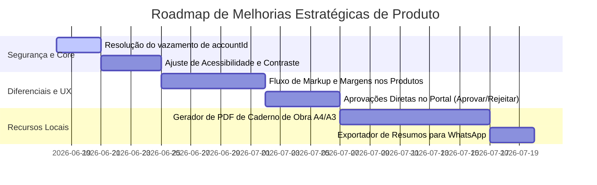

# Relatório de Benchmark Competitivo & Oportunidades de Produto
**Projeto:** Arch Smart  
**Autor:** Especialista Principal em UX/UI, Product Designer e Engenheiro Front-end Sênior  
**Destinatário:** Time de Desenvolvimento e Produto  
**Data:** 18 de Junho de 2026  

---

## 1. Introdução e Escopo

Este documento apresenta uma análise de benchmark de mercado do **Arch Smart** em relação aos seus principais concorrentes diretos, nacionais e internacionais, no segmento de softwares de gestão de projetos, especificação de produtos (FF&E) e colaboração para arquitetos e designers de interiores. 

O objetivo é mapear as lacunas funcionais e de experiência do usuário (UX/UI) e propor melhorias estratégicas baseadas nas melhores práticas do mercado, consolidando o diferencial competitivo da inteligência artificial (AI) do Arch Smart.

---

## 2. Concorrentes Analisados

1. **Programa** (Internacional): O atual padrão-ouro em especificação de mobiliário/acabamentos (FF&E). Destaca-se por um Web Clipper avançado, portal de aprovações de clientes e controle de compras.
2. **Mydoma Studio** (Estados Unidos): Focado em gerenciamento completo de escritórios de design, integrando contabilidade, moodboards, banco de produtos e portal de clientes em formato white-label.
3. **Spec.in** (Brasil): Principal concorrente nacional. Focado em gerar pranchas de especificação técnica e tabelas de orçamento automatizadas para obras de forma rápida e simplificada.
4. **Houzz Pro** (Global): Gigante do setor que engloba CRM de clientes, orçamentos rápidos, clipper de produtos, cronogramas de obras e visualizadores 3D.

---

## 3. Matriz Comparativa de Funcionalidades

A tabela abaixo compara o status atual das funcionalidades básicas do Arch Smart com seus concorrentes:

| Funcionalidade | Arch Smart | Programa | Mydoma Studio | Spec.in | Houzz Pro |
| :--- | :---: | :---: | :---: | :---: | :---: |
| **Web Clipper de Produtos** | ✅ Básico | ⭐ Avançado | ✅ Médio | ❌ Não possui | ✅ Avançado |
| **Normalização por AI** | ⭐ Único | ❌ Não possui | ❌ Não possui | ❌ Não possui | ❌ Não possui |
| **Gerenciamento de Markup / Margem** | ❌ Não possui | ✅ Avançado | ✅ Avançado | ❌ Não possui | ✅ Avançado |
| **Exportação de Caderno de PDF (Obra)**| ❌ Não possui | ✅ Sim | ✅ Sim | ⭐ Excelente | ✅ Sim |
| **Portal de Aprovação do Cliente** | ✅ Sim | ⭐ Excelente | ✅ Sim | ❌ Não possui | ✅ Sim |
| **Controle Financeiro / Fluxo de Caixa**| ✅ Básico | ❌ Limitado | ⭐ Avançado | ❌ Não possui | ✅ Avançado |
| **Integração com WhatsApp (Brasil)** | ❌ Não possui | ❌ Não possui | ❌ Não possui | ✅ Básico | ❌ Não possui |

*Legenda: ⭐ Destaque de Mercado | ✅ Possui | ❌ Não possui*

---

## 4. Análise de Lacunas (Gap Analysis) e Oportunidades

### 4.1. Força Exclusiva do Arch Smart: Normalização por AI
> [!TIP]
> A funcionalidade de normalização por inteligência artificial do Arch Smart ([NormalizationSheet.tsx](file:///c:/Users/brenn/Downloads/01-Arch-Smart-main/ArchSmart-web/src/components/library/NormalizationSheet.tsx)) é o maior diferencial do produto.

Enquanto concorrentes como *Programa* e *Mydoma Studio* exigem que o usuário limpe manualmente os dados capturados de e-commerces (corrigindo nomes, formatando dimensões e baixando fotos), o Arch Smart utiliza IA para formatar e normalizar estes metadados.
* *Oportunidade*: Expandir isso para um **"Assistente de Sourcing por AI"**. A IA poderia sugerir alternativas mais baratas do mesmo produto em outras lojas ou calcular automaticamente o rendimento de caixas de revestimento baseando-se no DNA Técnico do ambiente ([DNAEditorSheet.tsx](file:///c:/Users/brenn/Downloads/01-Arch-Smart-main/ArchSmart-web/src/components/projects/environments/DNAEditorSheet.tsx)).

### 4.2. Onde o Arch Smart está Atrás (Lacunas Críticas)

#### A. Controle de Markup e Margem de Lucro (FF&E)
Softwares internacionais como o *Programa* e *Houzz Pro* são amplamente utilizados devido ao controle financeiro de compras. Eles permitem que o arquiteto defina:
1. **Preço de Custo (Net Price)**: O preço real pago ao fornecedor (geralmente com desconto de profissional).
2. **Markup / Margem**: A porcentagem de comissão do arquiteto.
3. **Preço de Venda (Client Price)**: O preço final exibido ao cliente no portal de aprovações.
* *Status no Arch Smart*: O banco de dados e a interface exibem apenas um campo de preço único ([ProductFormSheet.tsx#L282](file:///c:/Users/brenn/Downloads/01-Arch-Smart-main/ArchSmart-web/src/components/library/ProductFormSheet.tsx#L282)), impossibilitando que o profissional gerencie comissões de forma transparente ou emita orçamentos com descontos embutidos.

#### B. Exportação de Caderno de Especificação Técnica para Obra
O maior valor do concorrente nacional *Spec.in* é a facilidade de gerar PDFs diagramados com a listagem de tintas, pisos, revestimentos e luminárias para entregar aos pedreiros e eletricistas na obra.
* *Status no Arch Smart*: O app possui a galeria e o orçamento no Portal do Cliente ([page.tsx](file:///c:/Users/brenn/Downloads/01-Arch-Smart-main/ArchSmart-web/src/app/portal/%5Buuid%5D/page.tsx)), mas não possui um botão de "Exportar PDF de Especificação" com fotos, dimensões, marcas e observações técnicas estruturado para impressão em formato A4/A3.

#### C. Interatividade no Portal de Aprovações do Cliente
No [Portal do Cliente do Arch Smart](file:///c:/Users/brenn/Downloads/01-Arch-Smart-main/ArchSmart-web/src/app/portal/%5Buuid%5D/page.tsx), o cliente consegue visualizar o orçamento das opções ([PortalBudget](file:///c:/Users/brenn/Downloads/01-Arch-Smart-main/ArchSmart-web/src/app/portal/%5Buuid%5D/components/PortalBudget)) e uma linha do tempo de mensagens ([PresentationTimeline](file:///c:/Users/brenn/Downloads/01-Arch-Smart-main/ArchSmart-web/src/app/portal/%5Buuid%5D/components/PresentationTimeline)).
* *Lacuna*: Falta interação imediata de aprovação/rejeição de itens específicos (como o recurso do *DesignFiles* onde o cliente clica em "Aprovar" ou "Rejeitar" e insere a justificativa, atualizando o orçamento geral em tempo real).

---

## 5. Propostas Técnicas de Solução e UX/UI

### 5.1. Implementação de Markup Semântico na Precificação
* **UI/UX**: Modificar o formulário de cadastro de produtos ([ProductFormSheet.tsx](file:///c:/Users/brenn/Downloads/01-Arch-Smart-main/ArchSmart-web/src/components/library/ProductFormSheet.tsx)) para incluir os campos: `Preço de Custo (R$)`, `Markup (%)` e `Preço de Venda (R$)` (calculado dinamicamente via JS na tela).
* **Portal**: No Portal do Cliente, exibir estritamente o `Preço de Venda`, mantendo a confidencialidade do custo de fornecedor do profissional de arquitetura.

### 5.2. Funcionalidade "Exportar Caderno de Obras" (PDF Engine)
* **Tecnologia**: Implementar a biblioteca `@react-pdf/renderer` ou configurar rotas de impressão CSS (`@media print`) otimizadas na página do projeto para permitir que o arquiteto gere um documento diagramado e limpo em PDF com um único clique.
* **Layout**: O PDF deve agrupar as peças por ambiente, exibindo imagem, dimensões, fabricante, link de compra e observações técnicas.

### 5.3. Interações de Feedback no Portal (Aprovar / Recusar)
* **UX**: No componente de Orçamento do Cliente ([PortalBudget](file:///c:/Users/brenn/Downloads/01-Arch-Smart-main/ArchSmart-web/src/app/portal/%5Buuid%5D/components/PortalBudget)), adicionar botões flutuantes de status "Aprovar Item" e "Trocar Opção" ao lado de cada produto listado.
* **Heurística**: A ação deve atualizar imediatamente o saldo total estimado do ambiente, reduzindo o tempo de fechamento de contratos de especificação.

### 5.4. Exportar Orçamento Simplificado para WhatsApp
* **Foco no Mercado Brasileiro**: Criar uma função de compartilhamento que gera uma mensagem formatada com markdown de WhatsApp (ex: `*Ambiente: Cozinha* \n- Geladeira Brastemp: R$ 5.400,00 \n- Cuba Inox Debacco: R$ 1.200,00`). Arquitetos brasileiros frequentemente consolidam especificações pelo aplicativo móvel.

---

## 6. Roadmap de Melhorias Recomendado (Priorização)

### Resumo de Ação Imediata:
1. **Curto Prazo (Sprint 1)**: Ajustar a vulnerabilidade do `accountId` (UX-07) e realizar correções de contrastes visuais identificados na auditoria anterior.
2. **Médio Prazo (Sprint 2 & 3)**: Desenvolver a funcionalidade de markup em produtos e os botões de ação do cliente (Aprovar/Rejeitar) no portal do cliente, nivelando o Arch Smart com as ferramentas americanas.
3. **Longo Prazo (Sprint 4)**: Implementar a engine de PDF de especificações técnicas para obras físicas, atacando o nicho dominado pelo *Spec.in* no mercado nacional.
